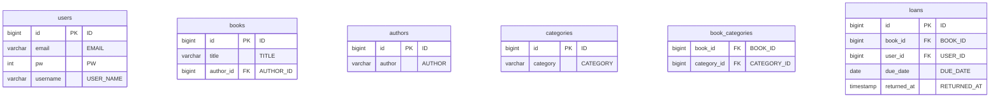

# ER Diagram

```mermaid
erDiagram
    users {
        bigint id PK "ID"
        varchar email "EMAIL"
        int pw "PW"
        varchar username "USER_NAME"
        }
    books {
        bigint id PK "ID"
        varchar title "TITLE"
        bigint author_id FK "AUTHOR_ID"
        }
    authors {
        bigint id PK "ID"
        varchar author "AUTHOR"
    }
    categories {
        bigint id PK "ID"
        varchar category "CATEGORY"
    }
    book_categories {
        bigint book_id FK "BOOK_ID"
        bigint category_id FK "CATEGORY_ID"
    }
    loans {
        bigint id PK "ID"
        bigint book_id FK "BOOK_ID"
        bigint user_id FK "USER_ID"
        date   due_date "DUE_DATE"
        timestamp returned_at "RETURNED_AT"
    }
```
